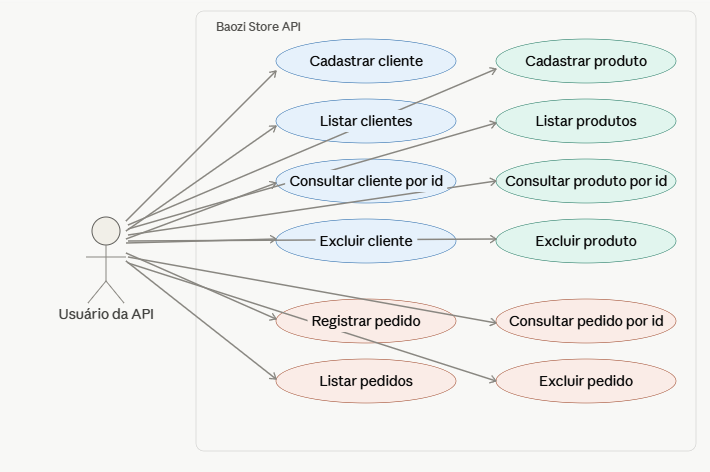

# Baozi Store API

API REST desenvolvida como atividade prática da disciplina de Desenvolvimento Web Back-End (UNINTER), simulando o sistema de controle de clientes, produtos e pedidos de uma loja fictícia de pãozinho chinês, a **Baozi Store**.

## Tecnologias utilizadas

- Java
- Spring Boot
- Spring Data JPA
- MySQL
- Postman (testes)
- Maven

## Arquitetura

O projeto segue o padrão MVC do Spring, organizado em camadas:

```
org.arianewelke.baozistore
├── controller   → endpoints REST (recebe requisições HTTP)
├── service      → regras de negócio
├── repository   → acesso a dados (Spring Data JPA)
└── entity       → entidades JPA mapeadas para o banco relacional
```

## Entidades

### Cliente
| Campo | Tipo |
|---|---|
| id | Long |
| nome | String |
| clienteDesde | LocalDate |

### Produto
| Campo | Tipo |
|---|---|
| id | Long |
| nome | String |
| preco | BigDecimal |
| estoque | Boolean |

### Pedido
| Campo | Tipo |
|---|---|
| id | Long |
| clienteId | Long |
| produtoId | Long |
| quantidade | Integer |

## Endpoints

Cada entidade (`/cliente`, `/produto`, `/pedido`) implementa o mesmo padrão de rotas:

| Método | Rota | Descrição |
|---|---|---|
| POST | `/{entidade}` | Cadastra um novo registro |
| GET | `/{entidade}` | Lista todos os registros |
| GET | `/{entidade}/{id}` | Consulta um registro pelo id |
| DELETE | `/{entidade}/{id}` | Remove um registro pelo id |

## Diagrama de caso de uso



## Como executar o projeto

### Pré-requisitos
- Java 17+
- MySQL (local ou remoto)

### 1. Clonar o repositório
```bash
git clone https://github.com/arianewelke/baozi-store.git
cd baozi-store
```

### 2. Criar o banco de dados
```sql
CREATE DATABASE IF NOT EXISTS baozistore;
```

### 3. Configurar as credenciais do banco

As credenciais não estão versionadas no `application.properties` por segurança. Defina as variáveis de ambiente antes de rodar a aplicação:

```bash
export DB_USERNAME=seu_usuario
export DB_PASSWORD=sua_senha
```

### 4. Rodar a aplicação
```bash
./mvnw spring-boot:run
```

A API ficará disponível em `http://localhost:8080`.

## Testes

Os testes da API foram realizados via Postman, cobrindo:
- Criação de cliente, produto e pedido (POST)
- Listagem geral de cada entidade (GET)
- Consulta por id (GET /{id})
- Remoção de registros (DELETE /{id})

## Autora

Ariane Welke
